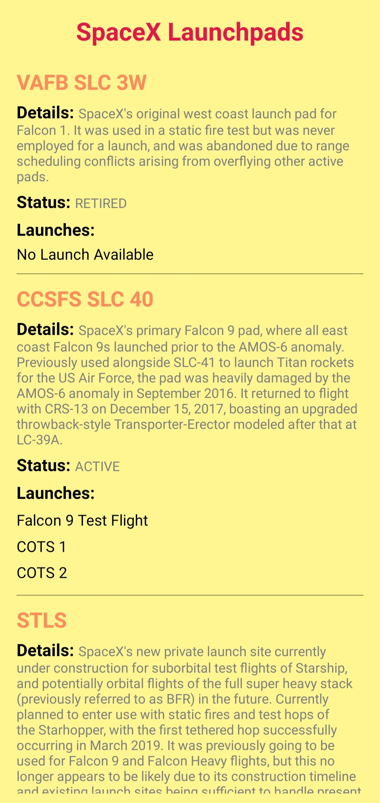
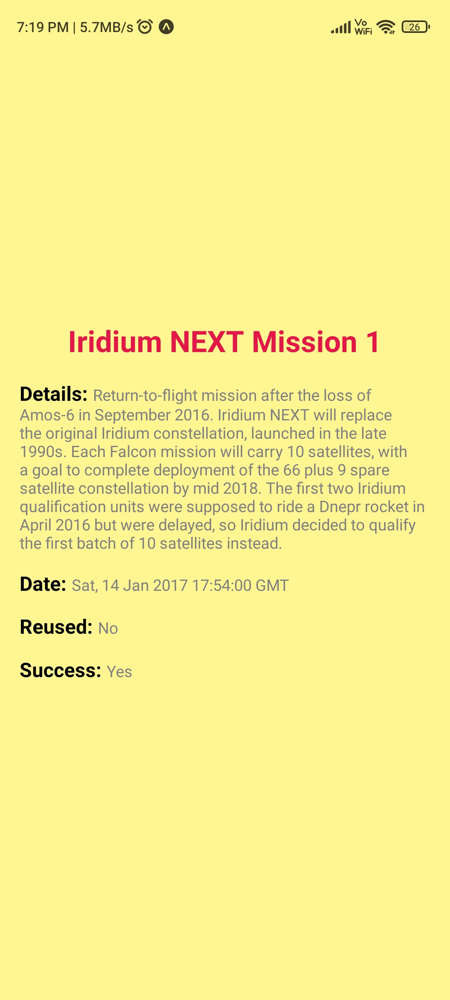

# SpaceX-Launchpads

This project is developed using SpaceX APIs. It provides details on the list of launchpads and their launches. This project is build using [React Native](https://reactnative.dev/) on JavaScript.

## Features

- Mobile Application consisting of 2 pages
- Details of Launchpads with their launches
- Clicking on a launch will their respective page

## Preview

**Page 1**

**Page 2**

