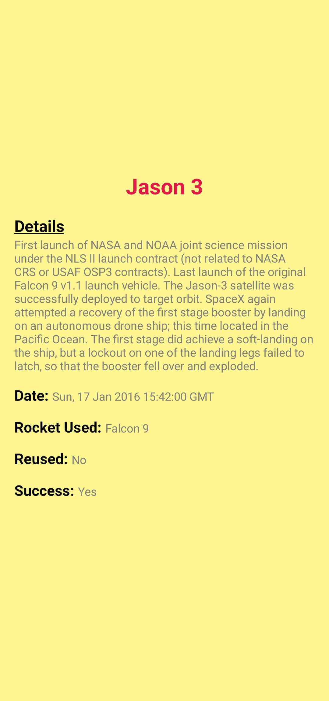

# SpaceX-Launchpads

This project is developed using [SpaceX APIs](https://github.com/r-spacex/SpaceX-API/tree/master/docs). It provides details on the list of launchpads and their launches. This project is build using [React Native](https://reactnative.dev/) on JavaScript.

## Features

- Mobile Application consisting of 2 pages
- Details of Launchpads with their launches
- Clicking on a launch will open their respective page

## Preview

|               **Page 1**                |               **Page 2**                |
| :-------------------------------------: | :-------------------------------------: |
|  |  |

